# Navigation Architecture - Complete Guide

**Version**: 2.0  
**Last Updated**: October 7, 2025  
**Status**: Active

## Executive Summary

Thriftwood uses a **hierarchical coordinator pattern** with SwiftUI's `NavigationStack`. Each coordinator manages its own navigation state and has **exactly one NavigationStack** at the coordinator view level.

### The Golden Rule

> **Each coordinator view creates ONE NavigationStack bound to its coordinator's path. Content views NEVER create NavigationStacks.**

## Architecture Overview

### High-Level Navigation Hierarchy


**Legend:**

- 🔵 **Blue boxes** = Views WITH NavigationStack (coordinator views only)
- 🟡 **Yellow boxes** = Views WITHOUT NavigationStack (content views)

## Where NavigationStack MUST Be

### ✅ Rule: NavigationStack at Coordinator View Level Only

Each coordinator view creates **exactly one** NavigationStack bound to its coordinator's `navigationPath`:

```swift
// ✅ CORRECT: SettingsCoordinatorView.swift
struct SettingsCoordinatorView: View {
    @Bindable var coordinator: SettingsCoordinator

    var body: some View {
        NavigationStack(path: $coordinator.navigationPath) {  // ✅ NavigationStack HERE
            SettingsView(coordinator: coordinator)
                .navigationDestination(for: SettingsRoute.self) { route in
                    destinationView(for: route)
                }
        }
    }

    @ViewBuilder
    private func destinationView(for route: SettingsRoute) -> some View {
        switch route {
        case .main:
            EmptyView()
        case .profiles:
            ProfileListView(coordinator: coordinator)  // ✅ No NavigationStack
        case .addProfile:
            AddProfileView(coordinator: coordinator)   // ✅ No NavigationStack
        // ... other routes
        }
    }
}
```

### ✅ NavigationStack Locations

| View Type            | Has NavigationStack? | Bound To                        | Example                                              |
| -------------------- | -------------------- | ------------------------------- | ---------------------------------------------------- |
| **Coordinator View** | ✅ YES               | `coordinator.navigationPath`    | `SettingsCoordinatorView`, `RadarrCoordinatorView`   |
| **Content View**     | ❌ NO                | N/A                             | `SettingsView`, `ProfileListView`, `MovieDetailView` |
| **Modal/Sheet**      | ✅ YES (optional)    | Own state or coordinator path   | `AddProfileView` in sheet                            |
| **Root App View**    | ✅ YES               | `AppCoordinator.navigationPath` | `MainAppNavigationView`                              |

## Where NavigationStack MUST NOT Be

### ❌ Rule: Content Views Never Create NavigationStack

Content views pushed via `navigationDestination` **must not** create their own NavigationStack:

```swift
// ❌ WRONG: SettingsView.swift (content view)
struct SettingsView: View {
    @State private var coordinator: SettingsCoordinator

    var body: some View {
        NavigationStack {  // ❌ WRONG! This creates nested NavigationStacks
            List {
                Button("Profiles") {
                    coordinator.navigate(to: .profiles)
                }
            }
        }
    }
}

// ✅ CORRECT: SettingsView.swift (content view)
struct SettingsView: View {
    @State private var coordinator: SettingsCoordinator

    var body: some View {
        List {  // ✅ No NavigationStack - just content
            Button("Profiles") {
                coordinator.navigate(to: .profiles)
            }
        }
        .navigationTitle("Settings")  // ✅ Navigation modifiers OK
        .toolbar {
            // ✅ Toolbar OK
        }
    }
}
```

### ❌ Prohibited NavigationStack Locations

| Location                       | Allowed? | Reason                                        |
| ------------------------------ | -------- | --------------------------------------------- |
| Inside `navigationDestination` | ❌ NO    | Creates nested stacks with incompatible types |
| Content views (pushed screens) | ❌ NO    | Already inside coordinator's NavigationStack  |
| ViewModels                     | ❌ NO    | ViewModels don't have views                   |
| Destination switch cases       | ❌ NO    | Already in navigation context                 |

## Navigation Flow Diagrams

### Correct Navigation Flow: Settings Example


### Incorrect Navigation Flow: What Happens with Nested Stacks

```mermaid
sequenceDiagram
    participant User
    participant AppNav as MainAppNavigationView<br/>(NavigationStack A: AppRoute)
    participant SettingsView as ❌ SettingsView with NavigationStack<br/>(NavigationStack B: SettingsRoute)

    User->>AppNav: Tap "Settings"
    AppNav->>AppNav: Append .settings to path
    AppNav->>SettingsView: Push SettingsView

    Note over SettingsView: ❌ Creates NESTED NavigationStack<br/>with different route type

    User->>SettingsView: Tap "Profiles"
    SettingsView->>SettingsView: Try to append .profiles

    Note over SettingsView: ❌ ERROR: "Only root-level navigation<br/>destinations are effective for a<br/>navigation stack with a<br/>homogeneous path"

    SettingsView->>User: Navigation fails<br/>Button does nothing
```



## Implementation Patterns

### Pattern 1: App-Level Coordinator (Root)

```swift
// ContentView.swift
struct MainAppNavigationView: View {
    @Bindable var coordinator: AppCoordinator

    var body: some View {
        NavigationStack(path: $coordinator.navigationPath) {  // ✅ Root NavigationStack
            AppHomeView(
                onNavigateToSettings: {
                    coordinator.navigateToSettings()
                }
            )
            .navigationDestination(for: AppRoute.self) { route in
                makeView(for: route)
            }
        }
    }

    @ViewBuilder
    private func makeView(for route: AppRoute) -> some View {
        switch route {
        case .settings:
            // ✅ Push coordinator view which has its own NavigationStack
            SettingsCoordinatorView(coordinator: settingsCoordinator)

        case .radarr:
            // ✅ Push coordinator view which has its own NavigationStack
            RadarrCoordinatorView(coordinator: radarrCoordinator)

        // ... other routes
        }
    }
}
```

### Pattern 2: Feature Coordinator View

```swift
// RadarrCoordinatorView.swift
struct RadarrCoordinatorView: View {
    @Bindable var coordinator: RadarrCoordinator

    var body: some View {
        NavigationStack(path: $coordinator.navigationPath) {  // ✅ Feature NavigationStack
            RadarrHomeView(
                onNavigateToMovies: {
                    coordinator.showMoviesList()
                }
            )
            .navigationDestination(for: RadarrRoute.self) { route in
                destination(for: route)
            }
        }
    }

    @ViewBuilder
    private func destination(for route: RadarrRoute) -> some View {
        switch route {
        case .home:
            EmptyView()  // Root view, not pushed

        case .moviesList:
            MoviesListView(coordinator: coordinator)  // ✅ Content only

        case .movieDetail(let id):
            MovieDetailView(movieId: id, coordinator: coordinator)  // ✅ Content only
        }
    }
}
```

### Pattern 3: Content View (No Navigation Stack)

```swift
// MoviesListView.swift
struct MoviesListView: View {
    let coordinator: RadarrCoordinator
    @Environment(\.dismiss) private var dismiss
    @State private var viewModel: MoviesListViewModel

    init(coordinator: RadarrCoordinator) {
        self.coordinator = coordinator
        self.viewModel = MoviesListViewModel(
            service: DIContainer.shared.resolve((any RadarrServiceProtocol).self)
        )
    }

    var body: some View {
        List(viewModel.movies) { movie in
            Button {
                coordinator.showMovieDetail(movieId: movie.id)  // ✅ Coordinator handles navigation
            } label: {
                MovieRowView(movie: movie)
            }
        }
        .navigationTitle("Movies")  // ✅ Navigation modifiers OK
        .toolbar {  // ✅ Toolbar OK
            ToolbarItem(placement: .primaryAction) {
                Button("Add") {
                    coordinator.showAddMovie()
                }
            }
        }
        .task {
            await viewModel.loadMovies()
        }
    }
}
```

### Pattern 4: Modal/Sheet with Navigation

```swift
// ProfileListView.swift
struct ProfileListView: View {
    @State private var showAddProfile = false

    var body: some View {
        List {
            // ... list content
        }
        .sheet(isPresented: $showAddProfile) {
            NavigationStack {  // ✅ OK: New presentation context
                AddProfileView(
                    onSave: { profile in
                        // Handle save
                        showAddProfile = false
                    }
                )
            }
        }
    }
}
```

## Common Errors and Solutions

### Error 1: "Only root-level navigation destinations..."

**Symptom**: Navigation buttons do nothing, error in console

**Console Output**:

```text
Only root-level navigation destinations are effective for a navigation stack with a homogeneous path.
cannot add handler to 4 from 1 - dropping
```

**Cause**: Content view creates NavigationStack when it's already inside one

**Solution**: Remove NavigationStack from content view

```swift
// ❌ Before (WRONG)
struct SettingsView: View {
    var body: some View {
        NavigationStack {  // ❌ Remove this
            List {
                // content
            }
        }
    }
}

// ✅ After (CORRECT)
struct SettingsView: View {
    var body: some View {
        List {  // ✅ Just content
            // content
        }
        .navigationTitle("Settings")
    }
}
```

### Error 2: Back button not working

**Cause**: Multiple NavigationStacks interfering with each other

**Solution**: Ensure only coordinator view has NavigationStack

### Error 3: Navigation path not updating

**Cause**: NavigationStack not bound to coordinator's path

**Solution**: Use `@Bindable` and bind path correctly

```swift
// ❌ Wrong
struct MyCoordinatorView: View {
    var coordinator: MyCoordinator  // ❌ Not @Bindable

    var body: some View {
        NavigationStack {  // ❌ Not bound to path
            // ...
        }
    }
}

// ✅ Correct
struct MyCoordinatorView: View {
    @Bindable var coordinator: MyCoordinator  // ✅ @Bindable

    var body: some View {
        NavigationStack(path: $coordinator.navigationPath) {  // ✅ Bound
            // ...
        }
    }
}
```

## Testing Navigation

### Test Coordinator Navigation Methods

```swift
@Test("Navigate to profiles updates path")
@MainActor
func navigateToProfiles() {
    let coordinator = SettingsCoordinator()
    coordinator.start()

    #expect(coordinator.navigationPath.count == 0)

    coordinator.navigate(to: .profiles)

    #expect(coordinator.navigationPath.count == 1)
    #expect(coordinator.navigationPath.last == .profiles)
}

@Test("Pop removes last route")
@MainActor
func popNavigation() {
    let coordinator = SettingsCoordinator()
    coordinator.start()
    coordinator.navigate(to: .profiles)
    coordinator.navigate(to: .addProfile)

    #expect(coordinator.navigationPath.count == 2)

    coordinator.pop()

    #expect(coordinator.navigationPath.count == 1)
    #expect(coordinator.navigationPath.last == .profiles)
}
```

### Manual Testing Checklist

- [ ] Navigate from home to settings
- [ ] Tap each settings button (Profiles, Appearance, etc.)
- [ ] Verify screens appear
- [ ] Use back button to return
- [ ] Navigate deep (3+ levels)
- [ ] Pop to root works
- [ ] Check for console errors
- [ ] Test on both macOS and iOS

## NavigationStack Decision Tree

```mermaid
flowchart TD
    Start[Need to add NavigationStack?]
    Start --> Q1{Is this a<br/>Coordinator View?}

    Q1 -->|Yes| Q2{Does it manage<br/>navigation state?}
    Q2 -->|Yes| AddStack[✅ ADD NavigationStack<br/>bound to coordinator.navigationPath]
    Q2 -->|No| NoStack1[❌ NO NavigationStack]

    Q1 -->|No| Q3{Is this a<br/>Content View?}
    Q3 -->|Yes| Q4{Is it shown<br/>in a sheet/modal?}
    Q4 -->|Yes| Q5{Does modal<br/>need navigation?}
    Q5 -->|Yes| AddStack
    Q5 -->|No| NoStack2[❌ NO NavigationStack]
    Q4 -->|No| NoStack3[❌ NO NavigationStack<br/>Already in parent's stack]

    Q3 -->|No| Q6{Is this the<br/>root ContentView?}
    Q6 -->|Yes| AddStack
    Q6 -->|No| NoStack4[❌ NO NavigationStack]

    style AddStack fill:#c8e6c9,stroke:#4caf50,stroke-width:3px
    style NoStack1 fill:#ffcdd2,stroke:#f44336,stroke-width:2px
    style NoStack2 fill:#ffcdd2,stroke:#f44336,stroke-width:2px
    style NoStack3 fill:#ffcdd2,stroke:#f44336,stroke-width:2px
    style NoStack4 fill:#ffcdd2,stroke:#f44336,stroke-width:2px
```



## Reference Implementation

### Current Thriftwood Coordinators

| Coordinator             | Has NavigationStack?              | Route Type        | Notes            |
| ----------------------- | --------------------------------- | ----------------- | ---------------- |
| `AppCoordinator`        | ✅ YES (in MainAppNavigationView) | `AppRoute`        | Root coordinator |
| `OnboardingCoordinator` | ✅ YES                            | `OnboardingRoute` | Separate flow    |
| `RadarrCoordinator`     | ✅ YES                            | `RadarrRoute`     | Feature module   |
| `SettingsCoordinator`   | ✅ YES                            | `SettingsRoute`   | Feature module   |

### Current Content Views (No NavigationStack)

- `AppHomeView`
- `ServicesHomeView`
- `SettingsView`
- `ProfileListView`
- `AddProfileView`
- `RadarrHomeView`
- `MoviesListView`
- `MovieDetailView`
- All other feature screens

## Additional Resources

### Related Documentation

- [NAVIGATION_QUICK_REFERENCE.md](./NAVIGATION_QUICK_REFERENCE.md) - Quick lookup for common patterns
- [ADR-0001: Single NavigationStack Per Coordinator](./decisions/0001-single-navigationstack-per-coordinator.md) - Architecture decision
- [NAVIGATION_TRACING.md](../NAVIGATION_TRACING.md) - Debugging navigation issues

### Apple Documentation

- [NavigationStack](https://developer.apple.com/documentation/swiftui/navigationstack)
- [NavigationPath](https://developer.apple.com/documentation/swiftui/navigationpath)
- [navigationDestination(for:destination:)](<https://developer.apple.com/documentation/swiftui/view/navigationdestination(for:destination:)>)

## Quick Reference Card

### The Four Rules

1. **✅ One NavigationStack per coordinator view**
2. **❌ Content views never create NavigationStack**
3. **✅ Bind NavigationStack to coordinator.navigationPath**
4. **✅ Use @Bindable for two-way binding**

### When in Doubt

Ask yourself:

1. Is this a coordinator view that manages navigation state? → **Add NavigationStack**
2. Is this pushed via navigationDestination? → **No NavigationStack**
3. Is this a modal/sheet that needs internal navigation? → **Add NavigationStack**
4. Is this any other content view? → **No NavigationStack**

---

**Last Fix**: October 7, 2025 - Fixed Settings and Radarr navigation by adding NavigationStack to coordinator views  
**Status**: ✅ All navigation working correctly
