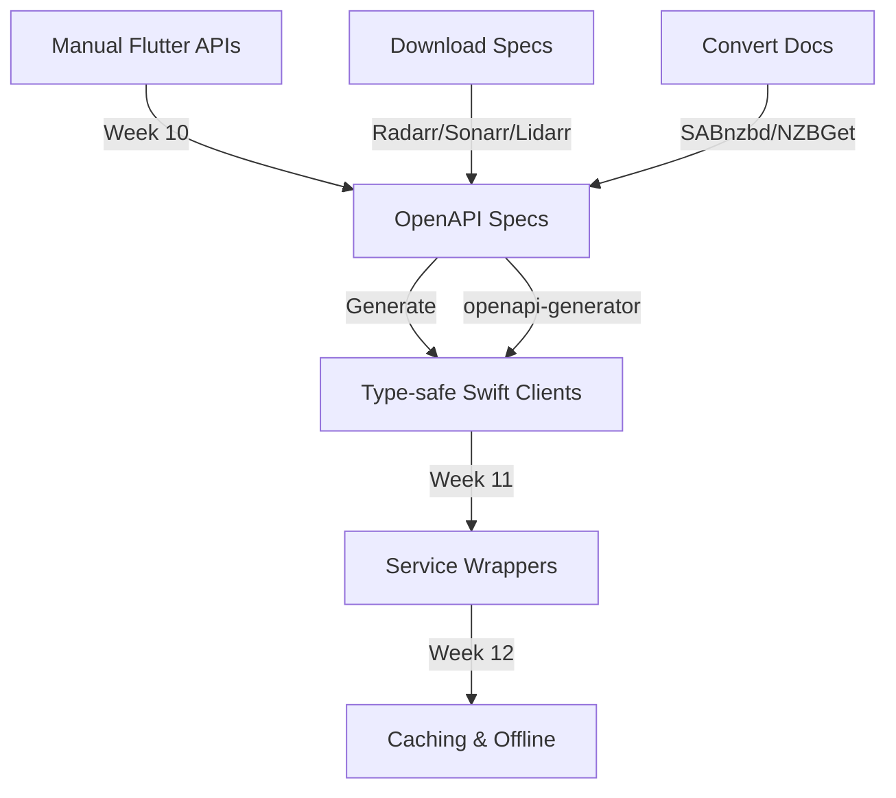

# Thriftwood Flutter to SwiftUI Swift-First Migration Plan

## Executive Summary

This document outlines a **Swift-first migration strategy** to transition Thriftwood from Flutter to pure SwiftUI on iOS. The approach eliminates code duplication by removing Flutter implementations completely once Swift equivalents are ready, with Flutter accessing Swift data models via bridge during the transition period.

## Migration Philosophy

**Swift-First Architecture with Code Elimination:**

- Start with 100% Flutter app
- Implement complete Swift features with SwiftUI
- **Remove Flutter code immediately upon Swift completion**
- Flutter accesses Swift data models via bridge (no duplication)
- Progressive elimination until 100% native iOS app
- **Single source of truth**: Swift implementations replace Flutter entirely

## CRITICAL RULE: No Code Duplication

**When a feature is fully implemented in Swift:**

1. Flutter implementation MUST be removed completely
2. Flutter accesses Swift data via method channel bridge
3. No parallel implementations or feature toggles
4. Swift becomes the single source of truth
5. One-time data migration from Flutter Hive to Swift SwiftData

## User Experience During Migration

**No User Toggle - Automatic Swift Usage:**

During migration, the app automatically uses Swift implementations when available:

- **Transparent to users**: Swift views used automatically when ready
- **No configuration needed**: Seamless experience without user intervention
- **Immediate delegation**: Flutter routes delegate to Swift when available
- **Progressive enhancement**: Each Swift feature immediately replaces Flutter

**Implementation Pattern:**

```dart
// Flutter automatically delegates to Swift when available
class SettingsRoute extends StatelessWidget {
  Widget build(BuildContext context) {
    return FutureBuilder<bool>(
      future: SwiftBridge.isFeatureAvailable('settings'),
      builder: (context, snapshot) {
        if (snapshot.data == true) {
          // Swift implementation available - delegate immediately
          WidgetsBinding.instance.addPostFrameCallback((_) async {
            await SwiftBridge.navigateToSwiftFeature('settings');
          });
          return Container(); // Temporary placeholder
        }

        // Swift not ready - show migration notice
        return MigrationPlaceholderView(
          feature: 'Settings',
          message: 'This feature is being upgraded to native iOS',
        );
      },
    );
  }
}
```

## Current State Analysis

### Flutter Implementation Structure

- **lib/modules/**: Feature modules (dashboard, radarr, sonarr, lidarr, etc.)
- **lib/api/**: Retrofit-based API clients for each service
- **lib/database/**: Hive-based profile management and configuration
- **lib/router/**: GoRouter-based navigation system
- **lib/widgets/**: Shared UI components
- **ios/**: Flutter iOS app with Runner target

### Components Requiring Migration

#### Data Layer

- **Hive Database** → SwiftData/Core Data
  - Profile configurations
  - Service settings
  - User preferences
  - Cache data

#### API Layer

- **Retrofit/Dio Clients** → URLSession + async/await
  - Radarr API client
  - Sonarr API client
  - Lidarr API client
  - SABnzbd API client
  - NZBGet API client
  - Tautulli API client
  - Wake-on-LAN implementation

#### Infrastructure

- **Navigation** → NavigationStack/NavigationSplitView
- **State Management** → @Observable/@ObservableObject
- **Background Tasks** → BackgroundTasks framework
- **Notifications** → UserNotifications framework
- **Deep Linking** → Universal Links
- **Networking** → URLSession with async/await

### Target State

- Pure SwiftUI iOS app
- Modern Swift 6 with async/await and actors
- SwiftData for persistence
- iOS 18+ features and optimizations
- Native iOS frameworks for all functionality

## Hybrid Architecture Design

### 1. Flutter-SwiftUI Bridge System (Updated for Swift-First)

```swift
// Bridge enables Flutter to access Swift data without duplication
class FlutterSwiftUIBridge: NSObject {
    static let shared = FlutterSwiftUIBridge()

    private var completedFeatures: Set<String> = []
    private weak var flutterViewController: FlutterViewController?

    // Mark feature as complete in Swift (Flutter code should be removed)
    func markFeatureComplete(_ feature: String) {
        completedFeatures.insert(feature)
        notifyFlutterToRemoveImplementation(feature)
    }

    // Check if feature is Swift-complete
    func isFeatureComplete(_ feature: String) -> Bool {
        return completedFeatures.contains(feature)
    }

    // Handle Flutter data requests to Swift models
    @MainActor
    func handleDataRequest(_ call: FlutterMethodCall) async -> Any? {
        switch call.method {
        case "radarr.getMovies":
            return await RadarrService.shared.getMovies().map { $0.toDictionary() }
        case "radarr.addMovie":
            return await RadarrService.shared.addMovie(fromDict: call.arguments)
        // ... other data access methods
        default:
            return nil
        }
    }

    // Notify Flutter to remove its implementation
    private func notifyFlutterToRemoveImplementation(_ feature: String) {
        let channel = FlutterMethodChannel(
            name: "com.thriftwood.migration",
            binaryMessenger: flutterViewController!.binaryMessenger
        )
        channel.invokeMethod("removeFeature", arguments: ["feature": feature])
    }
}
```

### 2. Swift Data Models with Flutter Bridge Access

```swift
// Swift data models that Flutter can access via bridge
@Model
final class RadarrMovie {
    @Attribute(.unique) var id: Int
    var title: String
    var year: Int
    var hasFile: Bool

    // Bridge serialization for Flutter access
    func toDictionary() -> [String: Any] {
        return [
            "id": id,
            "title": title,
            "year": year,
            "hasFile": hasFile
        ]
    }

    static func fromDictionary(_ dict: [String: Any]) -> RadarrMovie? {
        guard let id = dict["id"] as? Int,
              let title = dict["title"] as? String,
              let year = dict["year"] as? Int else { return nil }

        let movie = RadarrMovie()
        movie.id = id
        movie.title = title
        movie.year = year
        movie.hasFile = dict["hasFile"] as? Bool ?? false
        return movie
    }
}

// Service that handles both Swift UI and Flutter bridge requests
@Observable
class RadarrService {
    static let shared = RadarrService()
    private let modelContext: ModelContext

    // CRUD operations accessible from both Swift and Flutter
    @MainActor
    func getMovies() async -> [RadarrMovie] {
        let descriptor = FetchDescriptor<RadarrMovie>()
        return (try? modelContext.fetch(descriptor)) ?? []
    }

    @MainActor
    func addMovie(fromDict: Any?) async -> [String: Any]? {
        guard let dict = fromDict as? [String: Any],
              let movie = RadarrMovie.fromDictionary(dict) else { return nil }

        modelContext.insert(movie)
        try? modelContext.save()
        return movie.toDictionary()
    }

    @MainActor
    func deleteMovie(id: Int) async -> Bool {
        guard let movie = try? modelContext.fetch(
            FetchDescriptor<RadarrMovie>(
                predicate: #Predicate { $0.id == id }
            )
        ).first else { return false }

        modelContext.delete(movie)
        try? modelContext.save()
        return true
    }
}
```

### 3. Flutter Bridge Client (Replaces Local Implementation)

```dart
// Flutter service becomes a bridge client - no local data storage
class RadarrService {
  static const _bridge = MethodChannel('com.thriftwood.swift_data');

  // Access Swift data models directly
  Future<List<RadarrMovie>> getMovies() async {
    final result = await _bridge.invokeMethod('radarr.getMovies');
    return (result as List).map((dict) => RadarrMovie.fromJson(dict)).toList();
  }

  Future<RadarrMovie?> addMovie(RadarrMovie movie) async {
    final result = await _bridge.invokeMethod('radarr.addMovie', movie.toJson());
    return result != null ? RadarrMovie.fromJson(result) : null;
  }

  Future<bool> deleteMovie(int movieId) async {
    final result = await _bridge.invokeMethod('radarr.deleteMovie', {'id': movieId});
    return result == true;
  }
}

// Flutter model becomes a simple data transfer object
class RadarrMovie {
  final int id;
  final String title;
  final int year;
  final bool hasFile;

  RadarrMovie({
    required this.id,
    required this.title,
    required this.year,
    this.hasFile = false,
  });

  // Bridge serialization only - no Hive storage
  factory RadarrMovie.fromJson(Map<String, dynamic> json) => RadarrMovie(
    id: json['id'],
    title: json['title'],
    year: json['year'],
    hasFile: json['hasFile'] ?? false,
  );

  Map<String, dynamic> toJson() => {
    'id': id,
    'title': title,
    'year': year,
    'hasFile': hasFile,
  };
}
```

## Step-by-Step Migration Process (Swift-First)

### ✅ Phase 1: Setup Hybrid Infrastructure (Week 1-2) - COMPLETED

**Status: COMPLETED**

### ✅ Phase 2: First Swift Implementation - Settings (Week 3-4) - COMPLETED

**Status: COMPLETED**

- ✅ Settings fully implemented in Swift
- ⚠️ Flutter settings code needs removal
- ⚠️ Bridge access needs implementation

### ✅ Phase 3: Dashboard Swift Implementation (Week 5-6) - COMPLETED

**Status: COMPLETED**

- ✅ Dashboard fully implemented in Swift
- ⚠️ Flutter dashboard code needs removal
- ⚠️ Bridge data access needs implementation

### Phase 4: Swift-First Data Migration (Week 7-9)

**Goal: Migrate data persistence to Swift with Flutter bridge access**

#### 4.1 SwiftData Implementation with Bridge

```swift
Tasks:
1. Create SwiftData models for all entities
2. Implement Flutter bridge for data access
3. One-time migration from Hive to SwiftData
4. Remove Flutter Hive implementations
5. Update Flutter to use Swift data via bridge
```

**Migration Implementation:**

```swift
// One-time data migration from Flutter Hive to SwiftData
class FlutterToSwiftDataMigrator {
    @MainActor
    func migrateAllData() async throws {
        // Check if migration already completed
        if UserDefaults.standard.bool(forKey: "data_migration_complete") {
            return
        }

        // Migrate each data type
        try await migrateProfiles()
        try await migrateRadarrData()
        try await migrateSonarrData()
        // ... other migrations

        // Mark migration complete
        UserDefaults.standard.set(true, forKey: "data_migration_complete")

        // Notify Flutter to clear Hive storage
        FlutterSwiftUIBridge.shared.notifyFlutterToClearStorage()
    }

    private func migrateRadarrData() async throws {
        // Read from Flutter Hive
        let hiveData = try await readFlutterHiveData("radarr_movies")

        // Convert to Swift models
        let movies = hiveData.compactMap { RadarrMovie.fromDictionary($0) }

        // Save to SwiftData
        for movie in movies {
            modelContext.insert(movie)
        }
        try modelContext.save()
    }
}
```

#### 4.2 Flutter Code Elimination Process

```dart
// Step 1: Update Flutter routes to delegate to Swift
class RadarrRoute extends StatelessWidget {
  Widget build(BuildContext context) {
    // Always delegate to Swift if available
    WidgetsBinding.instance.addPostFrameCallback((_) async {
      if (await SwiftBridge.isFeatureAvailable('radarr')) {
        await SwiftBridge.navigateToSwiftFeature('radarr');
      } else {
        // Show placeholder during migration
        Navigator.of(context).push(MaterialPageRoute(
          builder: (_) => MigrationPlaceholderView(feature: 'Radarr'),
        ));
      }
    });
    return Container();
  }
}

// Step 2: Remove Flutter implementation files
// DELETE: lib/modules/radarr/core/
// DELETE: lib/modules/radarr/routes/
// DELETE: lib/api/radarr/
// DELETE: lib/database/models/radarr/

// Step 3: Update pubspec.yaml - remove unused dependencies
// Remove: hive_generator, retrofit_generator (if no longer needed)
```

### Phase 5: API Client Swift-First Implementation (Week 10-12)

**Goal: Implement Swift API clients with Flutter bridge access**

```swift
// Swift API implementation with bridge support
actor RadarrAPIService {
    private let apiClient: RadarrAPI  // OpenAPI generated

    // Handle requests from both SwiftUI and Flutter
    @MainActor
    func handleRequest(_ method: String, arguments: Any?) async -> Any? {
        switch method {
        case "testConnection":
            return await testConnection()
        case "getSystemStatus":
            return await getSystemStatus()?.toDictionary()
        case "searchMovies":
            guard let query = arguments as? String else { return nil }
            return await searchMovies(query).map { $0.toDictionary() }
        default:
            return nil
        }
    }
}
```

### Phase 6: Progressive Feature Elimination (Week 13-16)

**For each service module (Radarr, Sonarr, Lidarr, etc.):**

1. **Implement complete Swift version** with all features
2. **Create Flutter bridge** for data and API access
3. **Migrate user data** from Hive to SwiftData
4. **Remove Flutter implementation** completely
5. **Update Flutter routes** to delegate to Swift
6. **Clean up dependencies** in pubspec.yaml

### Phase 7: Final Flutter Removal (Week 17-18)

```swift
Tasks:
1. Remove all Flutter UI code
2. Remove Flutter state management
3. Remove Flutter API clients
4. Remove Hive and all Flutter storage
5. Clean up pubspec.yaml to minimal bridge-only deps
6. Convert to pure iOS app with Swift Package Manager
```

## Testing Strategy for Infrastructure Migration

### OpenAPI Client Testing

```swift
func testOpenAPIRadarrClient() async throws {
    // Test with mock server that implements OpenAPI spec
    let mockServer = MockServer(specification: "radarr-v3.yaml")
    mockServer.start()

    let config = RadarrConfiguration(
        baseURL: mockServer.url,
        apiKey: "test-key"
    )
    let service = RadarrService(config: config)

    // Test all generated endpoints work correctly
    let movies = try await service.getMovies()
    XCTAssertNotNil(movies)

    // Verify request matches OpenAPI spec
    XCTAssertTrue(mockServer.validateLastRequest())

    // Test error handling
    mockServer.simulateError(.unauthorized)
    do {
        _ = try await service.getMovies()
        XCTFail("Should throw unauthorized error")
    } catch ServiceError.unauthorized {
        // Expected
    }
}

func testAPIVersionCompatibility() async throws {
    // Test against different API versions
    for version in ["3.0", "3.1", "3.2"] {
        let service = createServiceForVersion(version)

        // Core functionality should work across versions
        XCTAssertNoThrow(try await service.getMovies())

        // Version-specific features
        if version >= "3.2" {
            XCTAssertTrue(service.isFeatureSupported("customFormats"))
        }
    }
}
```

## Critical Migration Dependencies

### API Migration Strategy



## Migration Checklist Per Component (Swift-First)

**Feature Migration:**

- [ ] Implement complete Swift/SwiftUI version
- [ ] Create Flutter-Swift data bridge
- [ ] Test Swift implementation thoroughly
- [ ] Migrate existing user data to SwiftData
- [ ] **Remove Flutter implementation completely**
- [ ] Update Flutter routes to delegate to Swift
- [ ] Remove unused Flutter dependencies
- [ ] Document which features are Swift-complete
- [ ] Verify no functional regressions
- [ ] Performance validation

## Timeline Summary (Swift-First Approach)

| Phase | Duration | Deliverable              | Flutter Code Status              |
| ----- | -------- | ------------------------ | -------------------------------- |
| 1     | 2 weeks  | ✅ Hybrid infrastructure | 100% Flutter                     |
| 2     | 2 weeks  | ✅ Settings in Swift     | Settings removed from Flutter    |
| 3     | 2 weeks  | ✅ Dashboard in Swift    | Dashboard removed from Flutter   |
| 4     | 3 weeks  | Data layer in Swift      | Hive removed, bridge active      |
| 5     | 3 weeks  | API layer in Swift       | Flutter API clients removed      |
| 6     | 4 weeks  | Service modules in Swift | Service UIs removed from Flutter |
| 7     | 2 weeks  | Final cleanup            | All Flutter code removed         |
| 8     | 2 weeks  | Pure iOS optimization    | 100% Swift/SwiftUI               |

**Total: 20 weeks to pure Swift/SwiftUI app with zero code duplication**

## Benefits of Swift-First Migration

### Code Quality

- **Single source of truth** - No synchronization complexity
- **Reduced maintenance** - One implementation per feature
- **Better performance** - Native Swift without bridge overhead
- **Smaller app size** - Progressive Flutter code elimination

### Development Velocity

- **Faster development** - No parallel implementations
- **Easier testing** - Single codebase to validate
- **Clear progress** - Each feature either Flutter or Swift, never both
- **Modern architecture** - Latest Swift 6 and SwiftUI patterns

## Success Criteria

A feature migration is complete when:

- ✅ Swift implementation provides 100% functionality
- ✅ Flutter code for that feature is completely removed
- ✅ Flutter can access Swift data via bridge
- ✅ User experience is unchanged or improved
- ✅ No data loss during migration
- ✅ Performance meets or exceeds Flutter version

---

_This Swift-first migration plan eliminates code duplication by progressively replacing Flutter implementations with Swift, maintaining a single source of truth while providing bridge access during the transition period._
self.action = action
self.payload = try! JSONEncoder().encode(payload)
self.createdAt = Date()
self.retryCount = 0
}
}

actor OfflineQueueManager {
func enqueue(action: OfflineAction) async {
// Save to SwiftData
modelContext.insert(action)
try? modelContext.save()
}

    func processQueue() async {
        let actions = try? modelContext.fetch(
            FetchDescriptor<OfflineAction>(
                sortBy: [SortDescriptor(\.createdAt)]
            )
        )

        for action in actions ?? [] {
            if await processAction(action) {
                modelContext.delete(action)
            } else {
                action.retryCount += 1
            }
        }

        try? modelContext.save()
    }

}

````

#### 5.4 API Version Management

```swift
Tasks:
1. Support multiple API versions per service
2. Auto-detect server API version
3. Graceful degradation for older servers
4. Feature flags based on API capabilities
5. Migration paths for breaking changes
````

**Version Detection:**

```swift
protocol VersionedAPIService {
    var supportedVersions: [String] { get }
    var currentVersion: String? { get }

    func detectVersion() async throws -> String
    func isFeatureSupported(_ feature: String) -> Bool
}

extension RadarrService: VersionedAPIService {
    var supportedVersions: [String] {
        ["v3", "v4"]  // v4 is hypothetical future version
    }

    func detectVersion() async throws -> String {
        let status = try await apiClient.apiV3SystemStatusGet()
        // Parse version from response
        return parseAPIVersion(from: status.version)
    }

    func isFeatureSupported(_ feature: String) -> Bool {
        switch (feature, currentVersion) {
        case ("massEditor", "v3"): return true
        case ("manualImport", "v3"): return true
        case ("customFormats", let v) where v >= "v3.2": return true
        default: return false
        }
    }
}
```

## Testing Strategy for Infrastructure Migration

### OpenAPI Client Testing

```swift
func testOpenAPIRadarrClient() async throws {
    // Test with mock server that implements OpenAPI spec
    let mockServer = MockServer(specification: "radarr-v3.yaml")
    mockServer.start()

    let config = RadarrConfiguration(
        baseURL: mockServer.url,
        apiKey: "test-key"
    )
    let service = RadarrService(config: config)

    // Test all generated endpoints work correctly
    let movies = try await service.getMovies()
    XCTAssertNotNil(movies)

    // Verify request matches OpenAPI spec
    XCTAssertTrue(mockServer.validateLastRequest())

    // Test error handling
    mockServer.simulateError(.unauthorized)
    do {
        _ = try await service.getMovies()
        XCTFail("Should throw unauthorized error")
    } catch ServiceError.unauthorized {
        // Expected
    }
}

func testAPIVersionCompatibility() async throws {
    // Test against different API versions
    for version in ["3.0", "3.1", "3.2"] {
        let service = createServiceForVersion(version)

        // Core functionality should work across versions
        XCTAssertNoThrow(try await service.getMovies())

        // Version-specific features
        if version >= "3.2" {
            XCTAssertTrue(service.isFeatureSupported("customFormats"))
        }
    }
}
```

## Critical Migration Dependencies

### API Migration Strategy


## Migration Checklist Per Component

**API Client Migration:**

- [ ] Download/create OpenAPI specifications for all services
- [ ] Set up OpenAPI Generator in build pipeline
- [ ] Generate Swift clients with async/await
- [ ] Create service wrappers with consistent interfaces
- [ ] Implement authentication for each service type
- [ ] Add comprehensive error handling and retry logic
- [ ] Implement response caching strategy
- [ ] Add offline action queue
- [ ] Test against multiple server versions
- [ ] Performance comparison with Flutter client
- [ ] Document API version compatibility matrix

## Timeline Summary

| Phase | Duration | Deliverable                       | App State                               |
| ----- | -------- | --------------------------------- | --------------------------------------- |
| 1     | 2 weeks  | ✅ Hybrid infrastructure          | 100% Flutter + Bridge                   |
| 2     | 2 weeks  | ✅ Settings in SwiftUI            | ~95% Flutter + Settings                 |
| 3     | 2 weeks  | ✅ Dashboard in SwiftUI           | ~90% Flutter + Dashboard/Settings       |
| 4     | 3 weeks  | Core Infrastructure (Data & Base) | Flutter UI + Swift Infrastructure (50%) |
| 5     | 3 weeks  | API Clients Migration             | Flutter UI + Swift APIs (100%)          |
| 6     | 4 weeks  | Service Module UIs                | ~20% Flutter + Most SwiftUI             |
| 7     | 2 weeks  | Infrastructure Cleanup            | ~5% Flutter (removal in progress)       |
| 8     | 2 weeks  | Final Migration & Optimization    | 100% SwiftUI + Pure Swift               |

**Total: 20 weeks to pure Swift/SwiftUI app**

## Post-Migration Enhancements

Once migration is complete, these iOS-exclusive features can be added:

- **Widgets**: Home screen widgets for service status
- **App Clips**: Quick actions without full app
- **Shortcuts**: Siri shortcuts for common tasks
- **Live Activities**: Download progress on Dynamic Island
- **Focus Filters**: Service-specific focus modes
- **iCloud Sync**: Profile sync across devices
- **SharePlay**: Collaborative media selection

---

_This comprehensive migration plan ensures all components - UI, data, APIs, and infrastructure - are properly transitioned from Flutter to a pure Swift/SwiftUI implementation while maintaining full functionality throughout the migration process._
