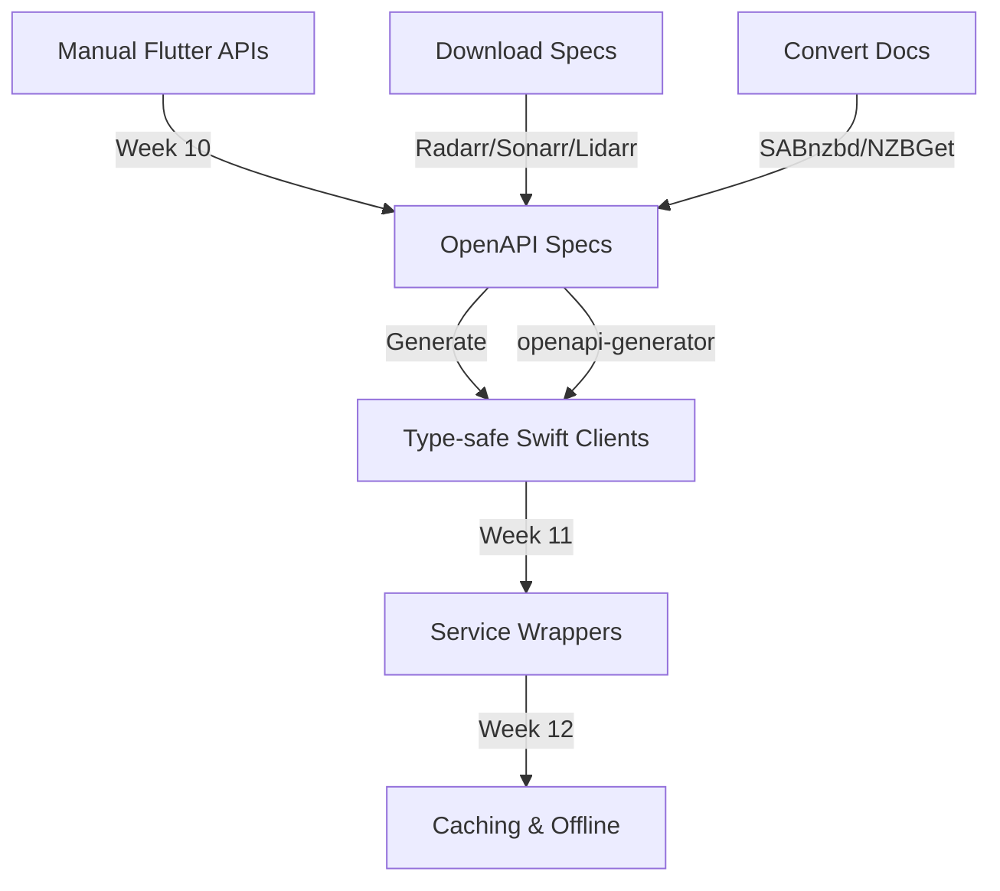

# Thriftwood Flutter to SwiftUI Hybrid Migration Plan

## Executive Summary

This document outlines a hybrid migration strategy to gradually transition Thriftwood from Flutter to pure SwiftUI on iOS. The approach maintains a fully functional app at every step, allowing Flutter and SwiftUI views to coexist seamlessly while transitioning one view at a time.

## Migration Philosophy

**Hybrid Coexistence Strategy:**

- Start with 100% Flutter app
- Gradually replace individual views with SwiftUI equivalents
- Migrate infrastructure components in parallel with UI
- Maintain seamless navigation between Flutter and SwiftUI views
- End with 100% SwiftUI app with pure Swift infrastructure
- App remains fully functional at every step of the migration

## User Migration Control

**User Choice During Migration:**

During the hybrid migration period, users have complete control over which implementation they use through a settings toggle. This ensures users can:

- **Fallback to stability**: If a SwiftUI implementation has issues, users can instantly switch back to the proven Flutter version
- **Test new features**: Users can opt into SwiftUI implementations to test new iOS-native features and performance improvements
- **Gradual adoption**: Users comfortable with the current Flutter experience can delay migration until SwiftUI versions are fully mature

**Implementation Details:**

- **Toggle Location**: Main Settings screen (`Settings > Settings Version`)
- **Database Storage**: `LunaSeaDatabase.HYBRID_SETTINGS_USE_SWIFTUI`
- **Default State**: Flutter (for maximum stability)
- **Scope**: Affects all settings navigation and related features
- **Data Consistency**: Both implementations read from the same data store
- **Real-time Switching**: Changes take effect immediately without app restart

**User Experience:**

```text
Settings Version
┌─────────────────────────────────────────────────────────┐
│ Currently using SwiftUI settings (iOS native experience) │
│                                               [Toggle ON] │
└─────────────────────────────────────────────────────────┘

Settings Version
┌──────────────────────────────────────────────────────────┐
│ Currently using Flutter settings (cross-platform experience) │
│                                               [Toggle OFF] │
└──────────────────────────────────────────────────────────┘
```

## Current State Analysis

### Flutter Implementation Structure

- **lib/modules/**: Feature modules (dashboard, radarr, sonarr, lidarr, etc.)
- **lib/api/**: Retrofit-based API clients for each service
- **lib/database/**: Hive-based profile management and configuration
- **lib/router/**: GoRouter-based navigation system
- **lib/widgets/**: Shared UI components
- **ios/**: Flutter iOS app with Runner target

### Components Requiring Migration

#### Data Layer

- **Hive Database** → SwiftData/Core Data
  - Profile configurations
  - Service settings
  - User preferences
  - Cache data

#### API Layer

- **Retrofit/Dio Clients** → URLSession + async/await
  - Radarr API client
  - Sonarr API client
  - Lidarr API client
  - SABnzbd API client
  - NZBGet API client
  - Tautulli API client
  - Wake-on-LAN implementation

#### Infrastructure

- **Navigation** → NavigationStack/NavigationSplitView
- **State Management** → @Observable/@ObservableObject
- **Background Tasks** → BackgroundTasks framework
- **Notifications** → UserNotifications framework
- **Deep Linking** → Universal Links
- **Networking** → URLSession with async/await

### Target State

- Pure SwiftUI iOS app
- Modern Swift 6 with async/await and actors
- SwiftData for persistence
- iOS 18+ features and optimizations
- Native iOS frameworks for all functionality

## Hybrid Architecture Design

### 1. Flutter-SwiftUI Bridge System

```swift
// Core bridge for seamless navigation between Flutter and SwiftUI
class FlutterSwiftUIBridge: NSObject {
    static let shared = FlutterSwiftUIBridge()

    private var nativeViews: Set<String> = []
    private weak var flutterViewController: FlutterViewController?

    // Register which views are now native
    func registerNativeView(_ route: String) {
        nativeViews.insert(route)
    }

    // Check if view should be native
    func shouldUseNativeView(for route: String) -> Bool {
        return nativeViews.contains(route)
    }

    // Present SwiftUI view from Flutter
    func presentNativeView(route: String, data: [String: Any] = [:]) {
        guard let flutterVC = flutterViewController,
              shouldUseNativeView(for: route) else { return }

        let swiftUIView = createSwiftUIView(for: route, data: data)
        let hostingController = UIHostingController(rootView: swiftUIView)

        flutterVC.present(hostingController, animated: true)
    }

    // Navigate back to Flutter
    func navigateBackToFlutter(data: [String: Any] = [:]) {
        // Send data back to Flutter and dismiss SwiftUI view
        flutterViewController?.dismiss(animated: true)
    }
}
```

### 2. Shared Data Layer

```swift
// Shared data models that work with both Flutter and SwiftUI
protocol SharedDataProtocol {
    func saveToFlutterStorage()
    func loadFromFlutterStorage()
    func notifyFlutterOfChanges()
}

// Profile system that works with both platforms
class SharedProfileManager: ObservableObject {
    @Published var activeProfile: Profile?

    // Read/write to Flutter's existing Hive storage
    func syncWithFlutterStorage() async {
        // Bidirectional sync with Flutter's database
    }
}
```

### 3. Navigation Coordination

```swift
// Coordinate navigation between Flutter and SwiftUI
class HybridNavigationCoordinator {
    func navigateFromFlutter(to route: String, data: [String: Any]) {
        if FlutterSwiftUIBridge.shared.shouldUseNativeView(for: route) {
            // Show SwiftUI view
            FlutterSwiftUIBridge.shared.presentNativeView(route: route, data: data)
        } else {
            // Continue with Flutter navigation
            // Send navigation command back to Flutter
        }
    }

    func navigateFromSwiftUI(to route: String, data: [String: Any]) {
        if FlutterSwiftUIBridge.shared.shouldUseNativeView(for: route) {
            // Show another SwiftUI view
        } else {
            // Navigate back to Flutter for this view
            FlutterSwiftUIBridge.shared.navigateBackToFlutter(data: data)
            // Then navigate in Flutter
        }
    }
}
```

## Step-by-Step Migration Process

### ✅ Phase 1: Setup Hybrid Infrastructure (Week 1-2) - COMPLETED

**Status: COMPLETED**

### ✅ Phase 2: First Hybrid View - Settings (Week 3-4) - COMPLETED

**Status: COMPLETED**

### ✅ Phase 3: Dashboard Migration (Week 5-6) - COMPLETED

**Status: COMPLETED**

### Phase 4: Core Infrastructure Migration (Week 7-9)

**Goal: Migrate critical infrastructure components to Swift**

#### 4.1 Data Persistence Migration

```swift
Tasks:
1. Create SwiftData models for all Hive boxes
2. Implement bidirectional sync during transition
3. Migrate profile configurations
4. Migrate service settings
5. Create data migration utilities
```

**SwiftData Models:**

```swift
// Profile model replacing Hive Box
@Model
final class Profile {
    @Attribute(.unique) var id: UUID
    var name: String
    var isActive: Bool

    // Service configurations
    var radarrConfig: RadarrConfiguration?
    var sonarrConfig: SonarrConfiguration?
    var lidarrConfig: LidarrConfiguration?
    var sabConfig: SABnzbdConfiguration?
    var nzbgetConfig: NZBGetConfiguration?
    var tautulliConfig: TautulliConfiguration?

    init(name: String) {
        self.id = UUID()
        self.name = name
        self.isActive = false
    }
}

@Model
final class RadarrConfiguration {
    var baseURL: String
    var apiKey: String
    var enabled: Bool
    var defaultQualityProfile: Int?
    var defaultRootFolder: String?

    init(baseURL: String, apiKey: String) {
        self.baseURL = baseURL
        self.apiKey = apiKey
        self.enabled = true
    }
}

// Hive ↔ SwiftData sync during transition
class DataMigrationManager {
    func syncFromHive() async throws {
        // Read from Hive boxes
        let hiveProfiles = await readHiveProfiles()

        // Convert and save to SwiftData
        for hiveProfile in hiveProfiles {
            let swiftDataProfile = convertToSwiftData(hiveProfile)
            modelContext.insert(swiftDataProfile)
        }

        try modelContext.save()
    }

    func syncToHive(_ profile: Profile) async throws {
        // Convert SwiftData to Hive format
        // Write back to maintain Flutter compatibility
    }
}
```

**✅ IMPLEMENTATION COMPLETE**: See [`PHASE_4_1_IMPLEMENTATION.md`](./PHASE_4_1_IMPLEMENTATION.md) for detailed documentation.

#### 4.2 API Client Infrastructure

```swift
Tasks:
1. Obtain OpenAPI specifications for all services
2. Set up OpenAPI Generator for Swift
3. Generate type-safe API clients from specs
4. Create service-specific wrappers for generated clients
5. Implement authentication and error handling layers
6. Add caching and offline support
```

**OpenAPI-Based API Strategy:**

```swift
// Using OpenAPI Generator for type-safe clients
// Install: brew install openapi-generator
// Generate: openapi-generator generate -i radarr-api.yaml -g swift5 -o ./Generated/RadarrAPI

// Service wrapper around generated OpenAPI client
actor RadarrService {
    private let apiClient: RadarrAPI  // Generated from OpenAPI spec
    private let config: RadarrConfiguration

    init(config: RadarrConfiguration) {
        self.config = config

        // Configure generated client with authentication
        let configuration = Configuration()
        configuration.basePath = config.baseURL
        configuration.apiKeyPrefix["X-Api-Key"] = config.apiKey

        self.apiClient = RadarrAPI(configuration: configuration)
    }

    // Wrap generated API calls with error handling and caching
    func getMovies() async throws -> [Movie] {
        do {
            // Use generated type-safe API call
            let response = try await apiClient.apiV3MovieGet()
            return response
        } catch {
            // Handle errors consistently
            throw ServiceError.apiError(error)
        }
    }

    func addMovie(_ movie: Movie, options: AddMovieOptions) async throws -> Movie {
        // Use generated models and endpoints
        let request = AddMovieRequest(
            movie: movie,
            addOptions: options
        )
        return try await apiClient.apiV3MoviePost(body: request)
    }
}

// Authentication interceptor for all services
class APIAuthenticationHandler {
    static func configure(for service: ServiceType, config: ServiceConfiguration) -> Configuration {
        let configuration = Configuration()
        configuration.basePath = config.baseURL

        // Handle different authentication methods
        switch service {
        case .radarr, .sonarr, .lidarr:
            configuration.apiKey["X-Api-Key"] = config.apiKey
        case .sabnzbd:
            configuration.apiKey["apikey"] = config.apiKey
        case .nzbget:
            // NZBGet uses basic auth
            configuration.username = config.username
            configuration.password = config.password
        case .tautulli:
            configuration.apiKey["apikey"] = config.apiKey
        }

        return configuration
    }
}
```

**OpenAPI Specification Management:**

```yaml
# ios/Native/OpenAPI/radarr-v3.yaml
# Download from: https://radarr.video/docs/api/
openapi: 3.0.0
info:
  title: Radarr API
  version: 3.0.0
# ... full OpenAPI spec

# ios/Native/OpenAPI/sonarr-v3.yaml
# Download from: https://sonarr.tv/docs/api/
openapi: 3.0.0
info:
  title: Sonarr API
  version: 3.0.0
# ... full OpenAPI spec
```

**Build Phase Script for API Generation:**

```bash
#!/bin/bash
# ios/Native/Scripts/generate-api-clients.sh

# Generate API clients from OpenAPI specs
OPENAPI_DIR="ios/Native/OpenAPI"
OUTPUT_DIR="ios/Native/Generated"

# Generate Radarr API client
openapi-generator generate \
  -i "$OPENAPI_DIR/radarr-v3.yaml" \
  -g swift5 \
  -o "$OUTPUT_DIR/RadarrAPI" \
  --additional-properties=responseAs=AsyncAwait,projectName=RadarrAPI

# Generate Sonarr API client
openapi-generator generate \
  -i "$OPENAPI_DIR/sonarr-v3.yaml" \
  -g swift5 \
  -o "$OUTPUT_DIR/SonarrAPI" \
  --additional-properties=responseAs=AsyncAwait,projectName=SonarrAPI

# Generate other service clients...
```

### Phase 5: Service API Clients Migration (Week 10-12)

**Goal: Integrate OpenAPI-generated clients with proper error handling and caching**

#### 5.1 OpenAPI Integration Setup

```swift
Tasks:
1. Download OpenAPI specifications for all services:
   - Radarr: https://radarr.video/docs/api/
   - Sonarr: https://sonarr.tv/docs/api/
   - Lidarr: https://lidarr.audio/docs/api/
   - SABnzbd: API documentation to OpenAPI conversion
   - NZBGet: API documentation to OpenAPI conversion
   - Tautulli: API documentation to OpenAPI conversion
2. Set up OpenAPI Generator in Xcode build pipeline
3. Generate Swift clients with async/await support
4. Create service wrappers with consistent error handling
5. Add response caching layer
6. Implement retry logic with exponential backoff
```

#### 5.2 Service Client Architecture

```swift
// Base service protocol for consistency
protocol MediaService {
    associatedtype Configuration
    associatedtype APIClient

    var config: Configuration { get }
    var apiClient: APIClient { get }

    func testConnection() async throws -> Bool
    func getSystemStatus() async throws -> SystemStatus
}

// Radarr implementation using generated client
actor RadarrService: MediaService {
    typealias Configuration = RadarrConfiguration
    typealias APIClient = RadarrAPI

    let config: RadarrConfiguration
    let apiClient: RadarrAPI
    private let cache = ResponseCache()

    init(config: RadarrConfiguration) {
        self.config = config

        let apiConfig = APIAuthenticationHandler.configure(
            for: .radarr,
            config: config
        )
        self.apiClient = RadarrAPI(configuration: apiConfig)
    }

    // Cache frequently accessed data
    func getMovies(useCache: Bool = true) async throws -> [Movie] {
        let cacheKey = "movies_\(config.profileId)"

        if useCache, let cached: [Movie] = cache.get(cacheKey) {
            return cached
        }

        let movies = try await withRetry {
            try await apiClient.apiV3MovieGet()
        }

        cache.set(movies, for: cacheKey, ttl: 300) // 5 min cache
        return movies
    }

    // Retry logic for network failures
    private func withRetry<T>(
        maxAttempts: Int = 3,
        operation: () async throws -> T
    ) async throws -> T {
        var lastError: Error?

        for attempt in 1...maxAttempts {
            do {
                return try await operation()
            } catch {
                lastError = error
                if attempt < maxAttempts {
                    // Exponential backoff
                    let delay = pow(2.0, Double(attempt))
                    try? await Task.sleep(nanoseconds: UInt64(delay * 1_000_000_000))
                }
            }
        }

        throw lastError ?? ServiceError.unknown
    }

    func testConnection() async throws -> Bool {
        do {
            _ = try await apiClient.apiV3SystemStatusGet()
            return true
        } catch {
            return false
        }
    }
}
```

#### 5.3 Offline Support & Caching

```swift
Tasks:
1. Implement ResponseCache with SwiftData backing
2. Add offline queue for actions (add/delete/update)
3. Sync offline actions when connection restored
4. Cache images and media artwork
5. Implement smart cache invalidation
```

**Caching Strategy:**

```swift
// Response caching with persistence
actor ResponseCache {
    private var memoryCache: [String: (data: Any, expiry: Date)] = [:]
    private let diskCache: DiskCache

    func get<T>(_ key: String) -> T? {
        // Check memory cache first
        if let cached = memoryCache[key],
           cached.expiry > Date() {
            return cached.data as? T
        }

        // Check disk cache
        return diskCache.get(key)
    }

    func set<T>(_ value: T, for key: String, ttl: TimeInterval) {
        let expiry = Date().addingTimeInterval(ttl)
        memoryCache[key] = (value, expiry)
        diskCache.set(value, for: key, expiry: expiry)
    }
}

// Offline action queue
@Model
final class OfflineAction {
    var id: UUID
    var service: String
    var action: String
    var payload: Data
    var createdAt: Date
    var retryCount: Int

    init(service: String, action: String, payload: Codable) {
        self.id = UUID()
        self.service = service
        self.action = action
        self.payload = try! JSONEncoder().encode(payload)
        self.createdAt = Date()
        self.retryCount = 0
    }
}

actor OfflineQueueManager {
    func enqueue(action: OfflineAction) async {
        // Save to SwiftData
        modelContext.insert(action)
        try? modelContext.save()
    }

    func processQueue() async {
        let actions = try? modelContext.fetch(
            FetchDescriptor<OfflineAction>(
                sortBy: [SortDescriptor(\.createdAt)]
            )
        )

        for action in actions ?? [] {
            if await processAction(action) {
                modelContext.delete(action)
            } else {
                action.retryCount += 1
            }
        }

        try? modelContext.save()
    }
}
```

#### 5.4 API Version Management

```swift
Tasks:
1. Support multiple API versions per service
2. Auto-detect server API version
3. Graceful degradation for older servers
4. Feature flags based on API capabilities
5. Migration paths for breaking changes
```

**Version Detection:**

```swift
protocol VersionedAPIService {
    var supportedVersions: [String] { get }
    var currentVersion: String? { get }

    func detectVersion() async throws -> String
    func isFeatureSupported(_ feature: String) -> Bool
}

extension RadarrService: VersionedAPIService {
    var supportedVersions: [String] {
        ["v3", "v4"]  // v4 is hypothetical future version
    }

    func detectVersion() async throws -> String {
        let status = try await apiClient.apiV3SystemStatusGet()
        // Parse version from response
        return parseAPIVersion(from: status.version)
    }

    func isFeatureSupported(_ feature: String) -> Bool {
        switch (feature, currentVersion) {
        case ("massEditor", "v3"): return true
        case ("manualImport", "v3"): return true
        case ("customFormats", let v) where v >= "v3.2": return true
        default: return false
        }
    }
}
```

## Testing Strategy for Infrastructure Migration

### OpenAPI Client Testing

```swift
func testOpenAPIRadarrClient() async throws {
    // Test with mock server that implements OpenAPI spec
    let mockServer = MockServer(specification: "radarr-v3.yaml")
    mockServer.start()

    let config = RadarrConfiguration(
        baseURL: mockServer.url,
        apiKey: "test-key"
    )
    let service = RadarrService(config: config)

    // Test all generated endpoints work correctly
    let movies = try await service.getMovies()
    XCTAssertNotNil(movies)

    // Verify request matches OpenAPI spec
    XCTAssertTrue(mockServer.validateLastRequest())

    // Test error handling
    mockServer.simulateError(.unauthorized)
    do {
        _ = try await service.getMovies()
        XCTFail("Should throw unauthorized error")
    } catch ServiceError.unauthorized {
        // Expected
    }
}

func testAPIVersionCompatibility() async throws {
    // Test against different API versions
    for version in ["3.0", "3.1", "3.2"] {
        let service = createServiceForVersion(version)

        // Core functionality should work across versions
        XCTAssertNoThrow(try await service.getMovies())

        // Version-specific features
        if version >= "3.2" {
            XCTAssertTrue(service.isFeatureSupported("customFormats"))
        }
    }
}
```

## Critical Migration Dependencies

### API Migration Strategy



## Migration Checklist Per Component

**API Client Migration:**

- [ ] Download/create OpenAPI specifications for all services
- [ ] Set up OpenAPI Generator in build pipeline
- [ ] Generate Swift clients with async/await
- [ ] Create service wrappers with consistent interfaces
- [ ] Implement authentication for each service type
- [ ] Add comprehensive error handling and retry logic
- [ ] Implement response caching strategy
- [ ] Add offline action queue
- [ ] Test against multiple server versions
- [ ] Performance comparison with Flutter client
- [ ] Document API version compatibility matrix

## Timeline Summary

| Phase | Duration | Deliverable                       | App State                               |
| ----- | -------- | --------------------------------- | --------------------------------------- |
| 1     | 2 weeks  | ✅ Hybrid infrastructure          | 100% Flutter + Bridge                   |
| 2     | 2 weeks  | ✅ Settings in SwiftUI            | ~95% Flutter + Settings                 |
| 3     | 2 weeks  | ✅ Dashboard in SwiftUI           | ~90% Flutter + Dashboard/Settings       |
| 4     | 3 weeks  | Core Infrastructure (Data & Base) | Flutter UI + Swift Infrastructure (50%) |
| 5     | 3 weeks  | API Clients Migration             | Flutter UI + Swift APIs (100%)          |
| 6     | 4 weeks  | Service Module UIs                | ~20% Flutter + Most SwiftUI             |
| 7     | 2 weeks  | Infrastructure Cleanup            | ~5% Flutter (removal in progress)       |
| 8     | 2 weeks  | Final Migration & Optimization    | 100% SwiftUI + Pure Swift               |

**Total: 20 weeks to pure Swift/SwiftUI app**

## Post-Migration Enhancements

Once migration is complete, these iOS-exclusive features can be added:

- **Widgets**: Home screen widgets for service status
- **App Clips**: Quick actions without full app
- **Shortcuts**: Siri shortcuts for common tasks
- **Live Activities**: Download progress on Dynamic Island
- **Focus Filters**: Service-specific focus modes
- **iCloud Sync**: Profile sync across devices
- **SharePlay**: Collaborative media selection

---

_This comprehensive migration plan ensures all components - UI, data, APIs, and infrastructure - are properly transitioned from Flutter to a pure Swift/SwiftUI implementation while maintaining full functionality throughout the migration process._
