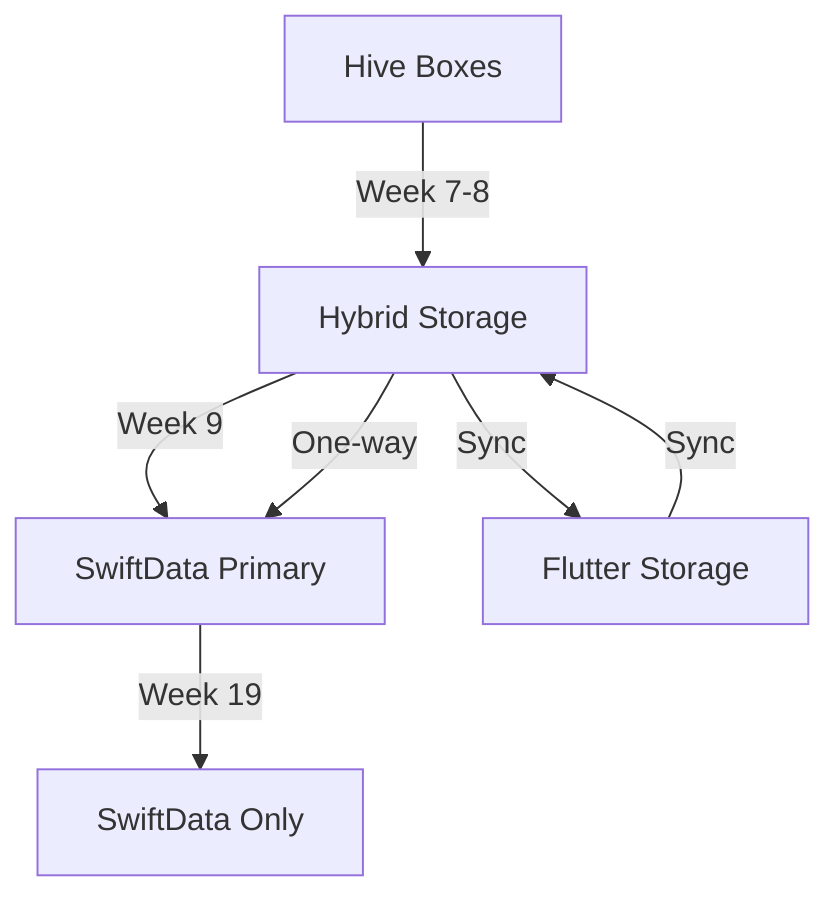
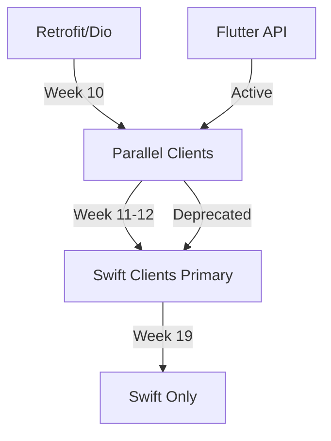

# Thriftwood Flutter to SwiftUI Hybrid Migration Plan

## Executive Summary

This document outlines a hybrid migration strategy to gradually transition Thriftwood from Flutter to pure SwiftUI on iOS. The approach maintains a fully functional app at every step, allowing Flutter and SwiftUI views to coexist seamlessly while transitioning one view at a time.

## Migration Philosophy

**Hybrid Coexistence Strategy:**

- Start with 100% Flutter app
- Gradually replace individual views with SwiftUI equivalents
- Migrate infrastructure components in parallel with UI
- Maintain seamless navigation between Flutter and SwiftUI views
- End with 100% SwiftUI app with pure Swift infrastructure
- App remains fully functional at every step of the migration

## User Migration Control

**User Choice During Migration:**

During the hybrid migration period, users have complete control over which implementation they use through a settings toggle. This ensures users can:

- **Fallback to stability**: If a SwiftUI implementation has issues, users can instantly switch back to the proven Flutter version
- **Test new features**: Users can opt into SwiftUI implementations to test new iOS-native features and performance improvements
- **Gradual adoption**: Users comfortable with the current Flutter experience can delay migration until SwiftUI versions are fully mature

**Implementation Details:**

- **Toggle Location**: Main Settings screen (`Settings > Settings Version`)
- **Database Storage**: `LunaSeaDatabase.HYBRID_SETTINGS_USE_SWIFTUI`
- **Default State**: Flutter (for maximum stability)
- **Scope**: Affects all settings navigation and related features
- **Data Consistency**: Both implementations read from the same data store
- **Real-time Switching**: Changes take effect immediately without app restart

**User Experience:**

```text
Settings Version
┌─────────────────────────────────────────────────────────┐
│ Currently using SwiftUI settings (iOS native experience) │
│                                               [Toggle ON] │
└─────────────────────────────────────────────────────────┘

Settings Version
┌──────────────────────────────────────────────────────────┐
│ Currently using Flutter settings (cross-platform experience) │
│                                               [Toggle OFF] │
└──────────────────────────────────────────────────────────┘
```

## Current State Analysis

### Flutter Implementation Structure

- **lib/modules/**: Feature modules (dashboard, radarr, sonarr, lidarr, etc.)
- **lib/api/**: Retrofit-based API clients for each service
- **lib/database/**: Hive-based profile management and configuration
- **lib/router/**: GoRouter-based navigation system
- **lib/widgets/**: Shared UI components
- **ios/**: Flutter iOS app with Runner target

### Components Requiring Migration

#### Data Layer

- **Hive Database** → SwiftData/Core Data
  - Profile configurations
  - Service settings
  - User preferences
  - Cache data

#### API Layer

- **Retrofit/Dio Clients** → URLSession + async/await
  - Radarr API client
  - Sonarr API client
  - Lidarr API client
  - SABnzbd API client
  - NZBGet API client
  - Tautulli API client
  - Wake-on-LAN implementation

#### Infrastructure

- **Navigation** → NavigationStack/NavigationSplitView
- **State Management** → @Observable/@ObservableObject
- **Background Tasks** → BackgroundTasks framework
- **Notifications** → UserNotifications framework
- **Deep Linking** → Universal Links
- **Networking** → URLSession with async/await

### Target State

- Pure SwiftUI iOS app
- Modern Swift 6 with async/await and actors
- SwiftData for persistence
- iOS 18+ features and optimizations
- Native iOS frameworks for all functionality

## Hybrid Architecture Design

### 1. Flutter-SwiftUI Bridge System

```swift
// Core bridge for seamless navigation between Flutter and SwiftUI
class FlutterSwiftUIBridge: NSObject {
    static let shared = FlutterSwiftUIBridge()

    private var nativeViews: Set<String> = []
    private weak var flutterViewController: FlutterViewController?

    // Register which views are now native
    func registerNativeView(_ route: String) {
        nativeViews.insert(route)
    }

    // Check if view should be native
    func shouldUseNativeView(for route: String) -> Bool {
        return nativeViews.contains(route)
    }

    // Present SwiftUI view from Flutter
    func presentNativeView(route: String, data: [String: Any] = [:]) {
        guard let flutterVC = flutterViewController,
              shouldUseNativeView(for: route) else { return }

        let swiftUIView = createSwiftUIView(for: route, data: data)
        let hostingController = UIHostingController(rootView: swiftUIView)

        flutterVC.present(hostingController, animated: true)
    }

    // Navigate back to Flutter
    func navigateBackToFlutter(data: [String: Any] = [:]) {
        // Send data back to Flutter and dismiss SwiftUI view
        flutterViewController?.dismiss(animated: true)
    }
}
```

### 2. Shared Data Layer

```swift
// Shared data models that work with both Flutter and SwiftUI
protocol SharedDataProtocol {
    func saveToFlutterStorage()
    func loadFromFlutterStorage()
    func notifyFlutterOfChanges()
}

// Profile system that works with both platforms
class SharedProfileManager: ObservableObject {
    @Published var activeProfile: Profile?

    // Read/write to Flutter's existing Hive storage
    func syncWithFlutterStorage() async {
        // Bidirectional sync with Flutter's database
    }
}
```

### 3. Navigation Coordination

```swift
// Coordinate navigation between Flutter and SwiftUI
class HybridNavigationCoordinator {
    func navigateFromFlutter(to route: String, data: [String: Any]) {
        if FlutterSwiftUIBridge.shared.shouldUseNativeView(for: route) {
            // Show SwiftUI view
            FlutterSwiftUIBridge.shared.presentNativeView(route: route, data: data)
        } else {
            // Continue with Flutter navigation
            // Send navigation command back to Flutter
        }
    }

    func navigateFromSwiftUI(to route: String, data: [String: Any]) {
        if FlutterSwiftUIBridge.shared.shouldUseNativeView(for: route) {
            // Show another SwiftUI view
        } else {
            // Navigate back to Flutter for this view
            FlutterSwiftUIBridge.shared.navigateBackToFlutter(data: data)
            // Then navigate in Flutter
        }
    }
}
```

## Step-by-Step Migration Process

### ✅ Phase 1: Setup Hybrid Infrastructure (Week 1-2) - COMPLETED

**Status: COMPLETED**

### ✅ Phase 2: First Hybrid View - Settings (Week 3-4) - COMPLETED

**Status: COMPLETED**

### ✅ Phase 3: Dashboard Migration (Week 5-6) - COMPLETED

**Status: COMPLETED**

### Phase 4: Core Infrastructure Migration (Week 7-9)

**Goal: Migrate critical infrastructure components to Swift**

#### 4.1 Data Persistence Migration

```swift
Tasks:
1. Create SwiftData models for all Hive boxes
2. Implement bidirectional sync during transition
3. Migrate profile configurations
4. Migrate service settings
5. Create data migration utilities
```

**SwiftData Models:**

```swift
// Profile model replacing Hive Box
@Model
final class Profile {
    @Attribute(.unique) var id: UUID
    var name: String
    var isActive: Bool

    // Service configurations
    var radarrConfig: RadarrConfiguration?
    var sonarrConfig: SonarrConfiguration?
    var lidarrConfig: LidarrConfiguration?
    var sabConfig: SABnzbdConfiguration?
    var nzbgetConfig: NZBGetConfiguration?
    var tautulliConfig: TautulliConfiguration?

    init(name: String) {
        self.id = UUID()
        self.name = name
        self.isActive = false
    }
}

@Model
final class RadarrConfiguration {
    var baseURL: String
    var apiKey: String
    var enabled: Bool
    var defaultQualityProfile: Int?
    var defaultRootFolder: String?

    init(baseURL: String, apiKey: String) {
        self.baseURL = baseURL
        self.apiKey = apiKey
        self.enabled = true
    }
}

// Hive ↔ SwiftData sync during transition
class DataMigrationManager {
    func syncFromHive() async throws {
        // Read from Hive boxes
        let hiveProfiles = await readHiveProfiles()

        // Convert and save to SwiftData
        for hiveProfile in hiveProfiles {
            let swiftDataProfile = convertToSwiftData(hiveProfile)
            modelContext.insert(swiftDataProfile)
        }

        try modelContext.save()
    }

    func syncToHive(_ profile: Profile) async throws {
        // Convert SwiftData to Hive format
        // Write back to maintain Flutter compatibility
    }
}
```

#### 4.2 API Client Infrastructure

```swift
Tasks:
1. Create base API client with URLSession
2. Implement authentication interceptors
3. Add error handling and retry logic
4. Create response decoders for each service
5. Implement API versioning support
```

**Base API Client:**

```swift
// Base API client replacing Retrofit/Dio
actor BaseAPIClient {
    private let session: URLSession
    private let decoder = JSONDecoder()

    init() {
        let config = URLSessionConfiguration.default
        config.timeoutIntervalForRequest = 30
        self.session = URLSession(configuration: config)
    }

    func request<T: Decodable>(
        _ endpoint: APIEndpoint,
        type: T.Type
    ) async throws -> T {
        var request = URLRequest(url: endpoint.url)
        request.httpMethod = endpoint.method.rawValue

        // Add authentication
        if let apiKey = endpoint.apiKey {
            request.setValue(apiKey, forHTTPHeaderField: "X-Api-Key")
        }

        let (data, response) = try await session.data(for: request)

        guard let httpResponse = response as? HTTPURLResponse,
              (200...299).contains(httpResponse.statusCode) else {
            throw APIError.invalidResponse
        }

        return try decoder.decode(T.self, from: data)
    }
}
```

### Phase 5: Service API Clients Migration (Week 10-12)

**Goal: Replace all Retrofit/Dio API clients with Swift implementations**

#### 5.1 Radarr API Client

```swift
Tasks:
1. Implement RadarrAPIClient with all endpoints
2. Create Swift models for all Radarr responses
3. Add movie management functions
4. Implement queue and history endpoints
5. Test against live Radarr instance
```

**Swift Implementation:**

```swift
// Radarr API client replacing lib/api/radarr/
actor RadarrAPIClient: BaseAPIClient {
    private let baseURL: URL
    private let apiKey: String

    func getMovies() async throws -> [RadarrMovie] {
        let endpoint = APIEndpoint(
            url: baseURL.appendingPathComponent("api/v3/movie"),
            method: .get,
            apiKey: apiKey
        )
        return try await request(endpoint, type: [RadarrMovie].self)
    }

    func addMovie(_ movie: RadarrMovie) async throws {
        let endpoint = APIEndpoint(
            url: baseURL.appendingPathComponent("api/v3/movie"),
            method: .post,
            apiKey: apiKey,
            body: movie
        )
        _ = try await request(endpoint, type: RadarrMovie.self)
    }

    func searchMovie(movieId: Int) async throws {
        let endpoint = APIEndpoint(
            url: baseURL.appendingPathComponent("api/v3/command"),
            method: .post,
            apiKey: apiKey,
            body: ["name": "MoviesSearch", "movieIds": [movieId]]
        )
        _ = try await request(endpoint, type: CommandResponse.self)
    }
}
```

#### 5.2 Sonarr API Client

```swift
Tasks:
1. Implement SonarrAPIClient with series/episode endpoints
2. Create Swift models for Sonarr responses
3. Add calendar and queue management
4. Implement episode file management
5. Test against live Sonarr instance
```

#### 5.3 Other Service Clients (Lidarr, SABnzbd, NZBGet, Tautulli)

```swift
Tasks:
1. Implement remaining API clients
2. Create response models for each service
3. Add service-specific functionality
4. Test against live instances
```

### Phase 6: Service Module UI Migration (Week 13-16)

**Goal: Migrate each service module UI one by one**

#### Week 13: Radarr Module

```swift
Tasks:
1. Create RadarrHomeView in SwiftUI
2. Implement movie list with poster grid
3. Create movie detail view with actions
4. Add search and filtering
5. Implement add movie workflow
6. Connect to new Swift API client
```

**SwiftUI Implementation:**

```swift
struct RadarrHomeView: View {
    @State private var service = RadarrService()
    @State private var searchText = ""

    var body: some View {
        NavigationStack {
            ScrollView {
                LazyVGrid(columns: columns) {
                    ForEach(service.filteredMovies(searchText)) { movie in
                        MoviePosterCard(movie: movie)
                            .onTapGesture {
                                selectedMovie = movie
                            }
                    }
                }
            }
            .searchable(text: $searchText)
            .navigationTitle("Movies")
            .task {
                await service.loadMovies()
            }
        }
    }
}

@Observable
class RadarrService {
    private let apiClient: RadarrAPIClient
    private let profileManager: ProfileManager

    var movies: [RadarrMovie] = []
    var isLoading = false

    init() {
        let config = profileManager.activeProfile?.radarrConfig
        self.apiClient = RadarrAPIClient(
            baseURL: config?.baseURL ?? "",
            apiKey: config?.apiKey ?? ""
        )
    }

    func loadMovies() async {
        isLoading = true
        do {
            movies = try await apiClient.getMovies()
        } catch {
            // Handle error
        }
        isLoading = false
    }
}
```

#### Week 14: Sonarr Module

```swift
Tasks:
1. Create SonarrHomeView with series grid
2. Implement series detail with season/episode views
3. Add calendar view for upcoming episodes
4. Create episode management actions
5. Connect to Swift API client
```

#### Week 15: Download Clients (SABnzbd, NZBGet)

```swift
Tasks:
1. Create unified download queue view
2. Implement queue management actions
3. Add download history view
4. Handle pause/resume/delete functionality
5. Create download statistics dashboard
```

#### Week 16: Remaining Modules

```swift
Tasks:
1. Lidarr: Artist and album management
2. Tautulli: Analytics and statistics views
3. Search: Cross-service search implementation
4. Wake-on-LAN: Network utilities
```

### Phase 7: Infrastructure Cleanup (Week 17-18)

**Goal: Remove Flutter dependencies and optimize for pure Swift**

#### 7.1 Navigation System Migration

```swift
Tasks:
1. Replace FlutterSwiftUIBridge with pure SwiftUI navigation
2. Implement deep linking with Universal Links
3. Remove method channels
4. Setup URL scheme handling
5. Add state restoration
```

**Pure SwiftUI Navigation:**

```swift
@main
struct ThriftwoodApp: App {
    @StateObject private var navigator = AppNavigator()
    @StateObject private var profileManager = ProfileManager()

    var body: some Scene {
        WindowGroup {
            ContentView()
                .environmentObject(navigator)
                .environmentObject(profileManager)
                .onOpenURL { url in
                    navigator.handleDeepLink(url)
                }
        }
    }
}

class AppNavigator: ObservableObject {
    @Published var path = NavigationPath()

    func handleDeepLink(_ url: URL) {
        // Parse URL and navigate accordingly
        if url.path.contains("radarr") {
            path.append(RadarrDestination())
        } else if url.path.contains("sonarr") {
            path.append(SonarrDestination())
        }
    }
}
```

#### 7.2 Background Tasks & Notifications

```swift
Tasks:
1. Implement BackgroundTasks for periodic sync
2. Setup UserNotifications for alerts
3. Add widget support
4. Implement App Clips for quick actions
5. Remove Flutter background services
```

### Phase 8: Final Migration & Optimization (Week 19-20)

**Goal: Complete transition to pure SwiftUI and optimize**

```swift
Tasks:
1. Remove all Flutter dependencies from Xcode project
2. Delete Flutter framework and assets
3. Clean up bridging code
4. Optimize app size and performance
5. Add iOS-exclusive features
```

**Final Project Structure:**

```
ios/Native/
├── App/
│   ├── ThriftwoodApp.swift         # Main app entry
│   └── ContentView.swift           # Root view
├── Models/
│   ├── Profile.swift               # SwiftData models
│   ├── RadarrModels.swift
│   ├── SonarrModels.swift
│   └── ...
├── Services/
│   ├── API/
│   │   ├── BaseAPIClient.swift
│   │   ├── RadarrAPIClient.swift
│   │   ├── SonarrAPIClient.swift
│   │   └── ...
│   ├── DataManager.swift          # SwiftData manager
│   └── ProfileManager.swift       # Profile management
├── Views/
│   ├── Dashboard/
│   │   └── DashboardView.swift
│   ├── Radarr/
│   │   ├── RadarrHomeView.swift
│   │   └── MovieDetailView.swift
│   ├── Sonarr/
│   │   ├── SonarrHomeView.swift
│   │   └── SeriesDetailView.swift
│   └── ...
└── Utilities/
    ├── Extensions/
    └── Helpers/
```

## Critical Migration Dependencies

### Data Migration Path



### API Client Migration Path



## Testing Strategy for Infrastructure Migration

### API Client Testing

```swift
func testRadarrAPIClient() async throws {
    // Test all endpoints
    let client = RadarrAPIClient(baseURL: testURL, apiKey: testKey)

    // Test movie fetch
    let movies = try await client.getMovies()
    XCTAssertFalse(movies.isEmpty)

    // Test search
    try await client.searchMovie(movieId: movies.first!.id)

    // Verify compatibility with Flutter API responses
    let flutterResponse = await getFlutterAPIResponse()
    let swiftResponse = try await client.getMovies()
    XCTAssertEqual(flutterResponse.count, swiftResponse.count)
}
```

### Data Migration Testing

```swift
func testDataMigration() async throws {
    // Test Hive to SwiftData migration
    let migrator = DataMigrationManager()

    // Create test data in Hive
    await createTestHiveData()

    // Migrate to SwiftData
    try await migrator.syncFromHive()

    // Verify all data migrated correctly
    let profiles = try modelContext.fetch(FetchDescriptor<Profile>())
    XCTAssertEqual(profiles.count, expectedCount)

    // Test bidirectional sync
    profiles.first?.name = "Updated"
    try await migrator.syncToHive(profiles.first!)

    // Verify Flutter can read updated data
    let hiveProfile = await readHiveProfile(id: profiles.first!.id)
    XCTAssertEqual(hiveProfile.name, "Updated")
}
```

## Success Criteria

**Infrastructure Migration Success:**

- [ ] All Hive data successfully migrated to SwiftData
- [ ] All API endpoints functioning with Swift clients
- [ ] Background tasks running natively
- [ ] Push notifications working
- [ ] Deep linking functional
- [ ] No Flutter dependencies remaining

**Per-Phase Success Criteria:**

- [ ] App builds and runs successfully
- [ ] All existing functionality preserved
- [ ] No crashes or navigation dead ends
- [ ] Data consistency maintained across platforms
- [ ] Performance equal or better than previous phase
- [ ] All deep links and external integrations work

**Final Success Criteria:**

- [ ] 100% SwiftUI implementation
- [ ] Zero Flutter dependencies
- [ ] All features from original Flutter app
- [ ] Improved performance and iOS integration
- [ ] App Store ready for iOS 18+

## Risk Mitigation

### Infrastructure Risks

- **Data Loss**: Implement backup before migration, maintain Hive until verified
- **API Compatibility**: Test against multiple server versions
- **Authentication**: Ensure API keys migrate correctly
- **Performance**: Profile Swift API clients vs Retrofit
- **Offline Support**: Implement caching in Swift clients

### Technical Risks

- **Navigation Complexity**: Maintain detailed navigation map, test all paths
- **Data Synchronization**: Use shared storage layer, implement conflict resolution
- **Performance**: Profile each phase, ensure no regressions
- **State Management**: Careful coordination between Flutter and SwiftUI state

### Process Risks

- **User Experience**: Maintain visual consistency during transition
- **Testing Complexity**: Automated testing for both platforms at each phase
- **Rollback Strategy**: Each phase can be rolled back independently
- **Timeline Delays**: 20% buffer built into each phase

## Migration Checklist Per Component

**API Client Migration:**

- [ ] Document all endpoints used by Flutter client
- [ ] Create Swift models for all responses
- [ ] Implement all endpoints in Swift
- [ ] Add comprehensive error handling
- [ ] Test against live services
- [ ] Performance comparison with Flutter client

**Data Migration:**

- [ ] Map all Hive boxes to SwiftData models
- [ ] Create migration utilities
- [ ] Implement bidirectional sync
- [ ] Test data integrity
- [ ] Plan rollback strategy
- [ ] Document data model changes

## Timeline Summary

| Phase | Duration | Deliverable                       | App State                               |
| ----- | -------- | --------------------------------- | --------------------------------------- |
| 1     | 2 weeks  | ✅ Hybrid infrastructure          | 100% Flutter + Bridge                   |
| 2     | 2 weeks  | ✅ Settings in SwiftUI            | ~95% Flutter + Settings                 |
| 3     | 2 weeks  | ✅ Dashboard in SwiftUI           | ~90% Flutter + Dashboard/Settings       |
| 4     | 3 weeks  | Core Infrastructure (Data & Base) | Flutter UI + Swift Infrastructure (50%) |
| 5     | 3 weeks  | API Clients Migration             | Flutter UI + Swift APIs (100%)          |
| 6     | 4 weeks  | Service Module UIs                | ~20% Flutter + Most SwiftUI             |
| 7     | 2 weeks  | Infrastructure Cleanup            | ~5% Flutter (removal in progress)       |
| 8     | 2 weeks  | Final Migration & Optimization    | 100% SwiftUI + Pure Swift               |

**Total: 20 weeks to pure Swift/SwiftUI app**

## Post-Migration Enhancements

Once migration is complete, these iOS-exclusive features can be added:

- **Widgets**: Home screen widgets for service status
- **App Clips**: Quick actions without full app
- **Shortcuts**: Siri shortcuts for common tasks
- **Live Activities**: Download progress on Dynamic Island
- **Focus Filters**: Service-specific focus modes
- **iCloud Sync**: Profile sync across devices
- **SharePlay**: Collaborative media selection

---

_This comprehensive migration plan ensures all components - UI, data, APIs, and infrastructure - are properly transitioned from Flutter to a pure Swift/SwiftUI implementation while maintaining full functionality throughout the migration process._
